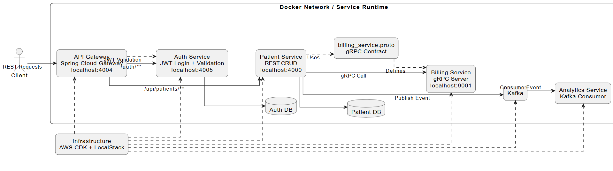

# Patient Management Microservices

A Spring Boot microservices system for patient management. This project demonstrates how to split a healthcare-style workflow across focused services while supporting secure access, inter-service communication, event-driven processing, and cloud-oriented deployment patterns.

## Project Snapshot

This repository implements a patient management platform built around multiple Spring Boot services:

- `api-gateway` fronts the platform and routes external requests.
- `auth-service` handles login and JWT token validation.
- `patient-service` owns patient CRUD operations.
- `billing-service` exposes a gRPC interface for billing-account creation.
- `analytics-service` consumes Kafka events for downstream analytics use cases.
- `infrastructure` defines AWS-style infrastructure using the AWS CDK.
- `integration-test` contains end-to-end API checks through the gateway.

The result is a project that demonstrates several real-world backend patterns in one codebase: REST APIs, gateway-based request routing, JWT security, synchronous gRPC calls, asynchronous Kafka events, persistence with JPA, and infrastructure-as-code.

## Highlights

- Clear service boundaries instead of a single monolith.
- Combines synchronous (REST, gRPC) and asynchronous (Kafka) communication patterns.
- JWT validation enforced at the gateway boundary.
- Infrastructure-as-code included alongside application code.
- Integration tests and request collections for easy demos.

## Architecture Diagram



## System Flow

### 1. Authentication

- Client sends credentials to `POST /auth/login` through the gateway.
- The gateway routes the request to `auth-service`.
- `auth-service` authenticates the user and returns a JWT.
- Protected patient routes require that JWT in the `Authorization: Bearer <token>` header.

### 2. Protected patient API

- Client calls `/api/patients/**` through `api-gateway`.
- The gateway filter forwards the token to `auth-service /validate`.
- On successful validation, the request is forwarded to `patient-service`.
- `patient-service` performs CRUD work against its persistence layer.

### 3. Internal billing

- When a patient is created, `patient-service` calls `billing-service` over gRPC.
- The contract is defined in `billing_service.proto`.

### 4. Event-driven analytics

- After a patient is created, `patient-service` publishes a Kafka event.
- `analytics-service` consumes that event for downstream processing.

## Services

### API Gateway

Path: [api-gateway](api-gateway)

- Spring Cloud Gateway on port `4004`.
- Routes `/auth/**` to `auth-service`.
- Routes `/api/patients/**` to `patient-service`.
- Applies JWT validation before forwarding protected patient requests.
- Exposes API-doc proxy routes for service OpenAPI docs.

### Auth Service

Path: [auth-service](auth-service)

- Spring Boot + Spring Security + JPA + JWT on port `4005`.
- `POST /login` — authenticate and receive a JWT.
- `GET /validate` — validate a token (called by the gateway).
- Seeds a demo user via `data.sql`.

### Patient Service

Path: [patient-service](patient-service)

- Spring Boot Web + Validation + JPA + OpenAPI + gRPC + Kafka on port `4000`.
- Exposes patient CRUD under `/patients`.
- On patient creation: saves the record, calls billing over gRPC, publishes a Kafka event.

### Billing Service

Path: [billing-service](billing-service)

- gRPC server using protobuf contracts.
- HTTP on port `4001`, gRPC on port `9001`.
- Receives billing-account creation requests from `patient-service`.

### Analytics Service

Path: [analytics-service](analytics-service)

- Consumes Kafka messages from the `patient` topic.
- Logs deserialized patient events; starting point for future analytics behavior.

### Infrastructure

Path: [infrastructure](infrastructure)

- AWS CDK in Java.
- Defines a VPC, ECS/Fargate services, PostgreSQL databases, and an MSK Kafka cluster.
- Includes LocalStack artifacts for local cloud emulation.

### Integration Tests

Path: [integration-test](integration-test)

- Rest Assured end-to-end tests through the gateway.
- Covers login and authenticated patient retrieval.

## Tech Stack

- Java 21
- Spring Boot 3.x
- Spring Cloud Gateway
- Spring Security
- Spring Data JPA
- PostgreSQL and H2
- gRPC + Protocol Buffers
- Apache Kafka
- OpenAPI / Swagger
- Maven
- AWS CDK
- LocalStack
- Rest Assured

## Repository Structure

```text
patient-management/
|-- api-gateway/
|-- auth-service/
|-- patient-service/
|-- billing-service/
|-- analytics-service/
|-- infrastructure/
|-- integration-test/
|-- api-requests/
`-- grpc-requests/
```

## API Surface

### Through the gateway

| Method     | Path                   |
| ---------- | ---------------------- |
| `POST`   | `/auth/login`        |
| `GET`    | `/api/patients`      |
| `POST`   | `/api/patients`      |
| `PUT`    | `/api/patients/{id}` |
| `DELETE` | `/api/patients/{id}` |

### API docs

| Path                       | Description             |
| -------------------------- | ----------------------- |
| `GET /api-docs/auth`     | Auth service OpenAPI    |
| `GET /api-docs/patients` | Patient service OpenAPI |

## Running Locally

### Prerequisites

- Java 21 and Maven
- PostgreSQL (for `auth-service` and `patient-service`)
- Kafka (for event flows)
- LocalStack (optional, for infrastructure)

### Start order

1. PostgreSQL instances for `auth-service` and `patient-service`
2. Kafka
3. `billing-service`
4. `auth-service`
5. `patient-service`
6. `api-gateway`
7. `analytics-service`

### Start command

From each service directory:

```bash
# Unix
./mvnw spring-boot:run

# Windows
.\mvnw.cmd spring-boot:run
```

## Demo Credentials

```
Email:    testuser@test.com
Password: password123
```
